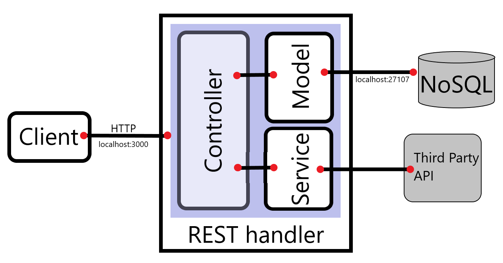

# InstaStore

InstaStore es un microservicio encargado de seleccionar la tienda mas cercana para entregar un pedido de comestibles a nuestros clientes.

# Información del requerimiento

1. Datos:
  Armar una estructura que se acomode a las necesidades (tomar como base las tiendas de Soriana en Monterrey y Ciudad de Mexico).

2. Seguridad:
- ¿Sistema de inicio de sesión para poder consumir el endpoint principal? 
  No es necesario.
- ¿Se debe restringir el microservicio para que solo ciertos dominios puedan acceder a el? 
  No, es una API pública.

3. Endpoint principal:
- ¿Cuál es la entrada del endpoint?
````
	{
	    "expectedDelivery": utcDate,
	    "destination": {
		     "name": "string",
	        "address": "string",
	        "address_two": "string",
	        "description": "string",
	        "country": "string",
	        "city": "string",
	        "state": "string",
	        "zip_code": "string",
	        "latitude": number,
	        "longitude": number
		}
    }
````
- ¿Cuál es la salida del endpoint?
````
	{
		"storeId": "string",
		"storeName": "string",
		"isOpen": boolean,
		"coordinates": {
			"latitude": number,
			"longitude": number
		},
		"nextDeliveryTime": utcDate
	}
````

- ¿Cuál debe ser el criterio para determinar la tienda más cercana? 
  Acá pueden haber dos enfoques (se realizarán ambos y así determinar el más conveniente):
	- Uso de una API externa para consultar cual es la tienda mas conveniente (El hecho de hacer llamado a un API externa podría afectar el rendimiento del endpoint pero el resultado sería mas preciso, pues se tendrían en cuenta aspectos como tráfico y distancia real)
	- Realizar una estimación interna sobre el tiempo de entrega con distancia geográfica (El rendimiento es mejor, pero la información es muy imprecisa, pues no siempre va a haber un camino directo entre los dos puntos además de que no se considere el tráfico)

4. Seguimiento del endpoint:
	Se almacenará información importante en una base de datos que permita al administrador poder hacer seguimiento de:
	- ¿Cuál es el movimiento de las diferentes tiendas?
	- ¿Ubicación de los mayores consumidores?
	- ¿Horas de mayor movimiento?

5. Características generales:
	- La API debe ser escrita en Node.js con Express.js
	- Tiempo de respuesta de los endpoints debe ser de a lo más 300 ms
	- Manejo correcto de respuesta de errores
	- Documentación de los endpoints.
	- Código que sea fácil de entender y que cumpla con los estándares mínimos de desarrollo

# Arquitectura del microservicio



- Se tendrán dos (2) controladores que permitirán desarrollar la funcionalidad antes especificada
	1. UserController: se encargará del inicio de sesión de un usuario, así como su validación.
	2. StoreController: se encargará de buscar la tienda más conveniente para una determinada ubicación además de permitir realizar seguimiento a las tiendas, clientes y estadísticas de interés.

# Entrega del producto

26 de Agosto a las 00:00 UTC

# Improvements and trade offs

1. What would you improve from your code? why?
2. Which trade offs would you make to accomplish this on time? What'd you do next time to deliver more and sacrifice less?
3. Do you think your service is secure? why?
4. What would you do to measure the behaviour of your product on a production environment?
